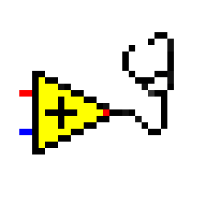

<!-- Based on https://github.com/othneildrew/Best-README-Template -->
<!-- PROJECT SHIELDS -->
<!--
*** I'm using markdown "reference style" links for readability.
*** Reference links are enclosed in brackets [ ] instead of parentheses ( ).
*** See the bottom of this document for the declaration of the reference variables
*** for contributors-url, forks-url, etc. This is an optional, concise syntax you may use.
*** https://www.markdownguide.org/basic-syntax/#reference-style-links
-->
[![Contributors][contributors-shield]][contributors-url]
[![Forks][forks-shield]][forks-url]
[![Stargazers][stars-shield]][stars-url]
[![Issues][issues-shield]][issues-url]
[![BSD-3-Clause License][license-shield]][license-url]

<!-- PROJECT LOGO -->
 

  

  <h3 align="center">Transparent Assertions</h3>

  

    LabVIEW&trade; assertion library with expressive test failures that supports different unit test frameworks.
     
    <a href="https://github.com/logmanoriginal/TransparentAssertions"><strong>Explore the docs »</strong></a>
     
     
    <a href="https://github.com/logmanoriginal/TransparentAssertions">View Demo</a>
     
    <a href="https://github.com/logmanoriginal/TransparentAssertions/issues">Report Bug</a>
     
    <a href="https://github.com/logmanoriginal/TransparentAssertions/issues">Request Feature</a>
  

## About The Project

Transparent Assertions provides a set of assertion functions for LabVIEW&trade; that are designed to be easy to use and provide expressive test failures that make it easy to understand what went wrong. The library is designed to be used with different unit test frameworks.

### Assertions
Transparent Assertions provides a wide range of assertion functions in the following categories:

* Boolean
* Collection (Array, Map, Set)
* Comparison
* Error
* Refnum
* String
* Type

### Supported Frameworks

Transparent Assertions supports the following unit test frameworks:
* [Caraya Unit Test Framework](https://github.com/vipm-io/Caraya)
* [LVUnit](https://github.com/logmanoriginal/LVUnit)

### Built With

* [LabVIEW&trade;](https://www.ni.com/labview)

## Getting Started

To get a local copy up and running follow these simple steps.

### Prerequisites

* [LabVIEW&trade;](https://ni.com/labview) 2017 or later
* [VI Package Manager](https://vipm.io/download/)

## Usage

Here is an example that uses Transparent Assertions with Caraya.

Caraya will display the test failure along with the assertion message and the expected and actual values.

## Roadmap

See the [open issues](https://github.com/logmanoriginal/TransparentAssertions/issues) for a list of proposed features (and known issues).

## Contributing

Contributions are what make the open source community such an amazing place to be learn, inspire, and create. Any contributions you make are **greatly appreciated**.

1. Fork the Project
2. Create your Feature Branch (`git checkout -b feature/AmazingFeature`)
3. Commit your Changes (`git commit -m 'Add some AmazingFeature'`)
4. Push to the Branch (`git push origin feature/AmazingFeature`)
5. Open a Pull Request

Keep in mind that LabVIEW&trade; VIs are binary files, which are difficult to merge.
- Only change a single VI or library.
- Avoid conflicts with other pull requests (don't work on the same libraries or VIs).
- Send VI Snippets (via issues) instead of pull requests when possible.

## License

Distributed under the BSD-3-Clause License. See [`LICENSE`](LICENSE.txt) for more information.

## Contact

Project Link: [https://github.com/logmanoriginal/TransparentAssertions](https://github.com/logmanoriginal/TransparentAssertions)

## Acknowledgements

* [Caraya Unit Test Framework](https://github.com/JKISoftware/Caraya)
* [JSONtext](https://bitbucket.org/drjdpowell/jsontext)

<!-- MARKDOWN LINKS & IMAGES -->
<!-- https://www.markdownguide.org/basic-syntax/#reference-style-links -->
[contributors-shield]: https://img.shields.io/github/contributors/logmanoriginal/TransparentAssertions?style=for-the-badge
[contributors-url]: https://github.com/logmanoriginal/TransparentAssertions/graphs/contributors
[forks-shield]: https://img.shields.io/github/forks/logmanoriginal/TransparentAssertions?style=for-the-badge
[forks-url]: https://github.com/logmanoriginal/TransparentAssertions/network/members
[stars-shield]: https://img.shields.io/github/stars/logmanoriginal/TransparentAssertions?style=for-the-badge
[stars-url]: https://github.com/logmanoriginal/TransparentAssertions/stargazers
[issues-shield]: https://img.shields.io/github/issues/logmanoriginal/TransparentAssertions?style=for-the-badge
[issues-url]: https://github.com/logmanoriginal/TransparentAssertions/issues
[license-shield]: https://img.shields.io/github/license/logmanoriginal/TransparentAssertions?style=for-the-badge
[license-url]: https://github.com/logmanoriginal/TransparentAssertions/blob/master/LICENSE.txt
